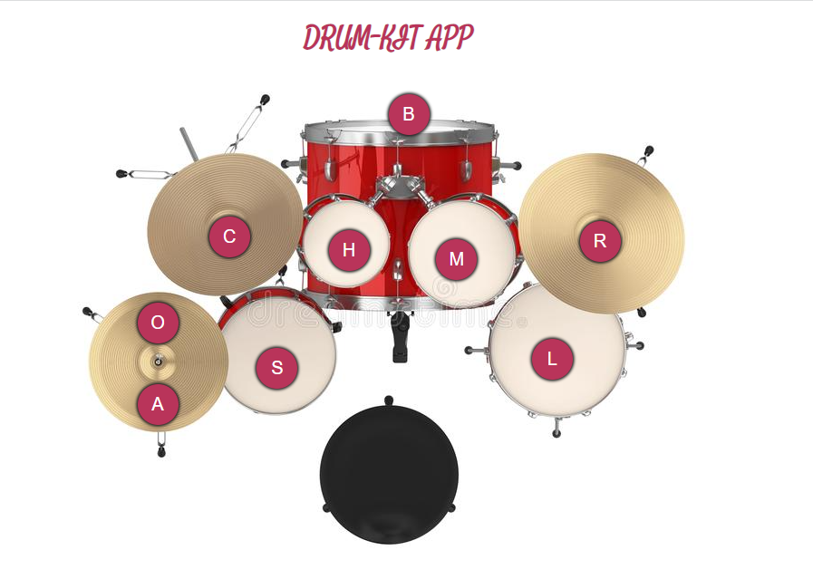

# Drum Kit App-JS
## Techniques Used
- html
- css
- Java Script

### Time Taken: 6 hours

In this drum kit app we can get particular drum effects when we press the button an also while pressing the particular character on keyboard.I have used constructor function 'new Audio()' to get sound effects.

